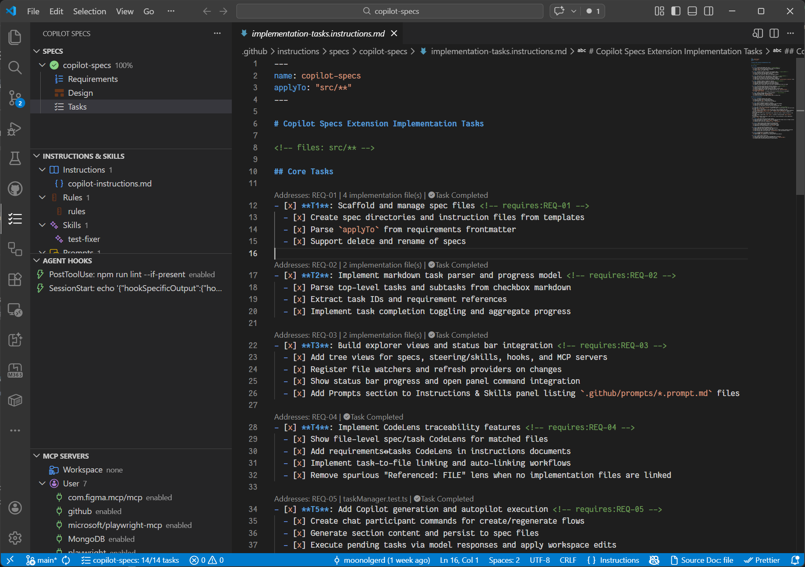

# Kiro for Copilot

[](https://marketplace.visualstudio.com/items?itemName=moonolgerd.kiro-for-copilot)
[](https://open-vsx.org/extension/moonolgerd/kiro-for-copilot)
[](https://marketplace.visualstudio.com/items?itemName=moonolgerd.kiro-for-copilot)
[](https://marketplace.visualstudio.com/items?itemName=moonolgerd.kiro-for-copilot)

Kiro-style spec-driven development inside VS Code, powered by GitHub Copilot.

`Kiro for Copilot` brings the Kiro workflow to any VS Code workspace — write structured **requirements**, **design**, and **task** documents, then let GitHub Copilot generate and execute them against your codebase. Every task is linked back to real source files via CodeLens so nothing gets lost.

## Install

**[Install from the VS Code Marketplace →](https://marketplace.visualstudio.com/items?itemName=moonolgerd.kiro-for-copilot)**

Or search for `Kiro for Copilot` in the VS Code Extensions panel (`Ctrl+Shift+X`).



## Features

- **Spec lifecycle**
  - Create, rename, and delete specs under `.github/instructions/specs/<spec-name>/`
  - Scaffold files from templates:
    - `requirements.instructions.md`
    - `design.instructions.md`
    - `implementation-tasks.instructions.md`

- **Task tracking + progress**
  - Parse markdown checkbox tasks and subtasks
  - Track completion progress per spec
  - Show spec progress in the status bar

- **Traceability with CodeLens**
  - Link requirements ↔ tasks
  - Link tasks ↔ implementation files
  - Auto-link task references to code

- **Copilot integration**
  - Generate requirements, design, and tasks with the `@spec` chat participant
  - Start Task opens a rich context prompt in **agent mode** — the agent can read files, make edits, and run tests
  - Verify All Tasks opens a spec-wide **agent-mode verification prompt** to validate completion against the codebase

- **Project guidance + tooling**
  - Instructions, rules, skills, and prompts explorer
  - Agent hooks explorer (`.github/hooks/*.json`)
  - MCP servers explorer and toggle support

## Requirements

- VS Code **1.93+**
- GitHub Copilot Chat (for AI generation and autopilot features)

## Quick Start

1. Install the extension from the [Marketplace](https://marketplace.visualstudio.com/items?itemName=moonolgerd.kiro-for-copilot).
2. Open a workspace and run `Copilot Specs: New Spec` from the Command Palette (`Ctrl+Shift+P`).
3. Enter a name — three scaffold files are created under `.github/instructions/specs/<name>/`:
   - `requirements.instructions.md` — define what to build
   - `design.instructions.md` — describe the architecture
   - `implementation-tasks.instructions.md` — break work into checkable tasks
4. Use the **@spec** chat participant in Copilot Chat to generate content:
   ```
   @spec create a user authentication feature
   ```
5. Click **Start Task** on any task — a rich context prompt opens in agent mode where Copilot can read your code, make edits, and verify the result.
6. Click **Verify All Tasks with Copilot** on a spec row to run a full completion verification workflow in agent mode.
