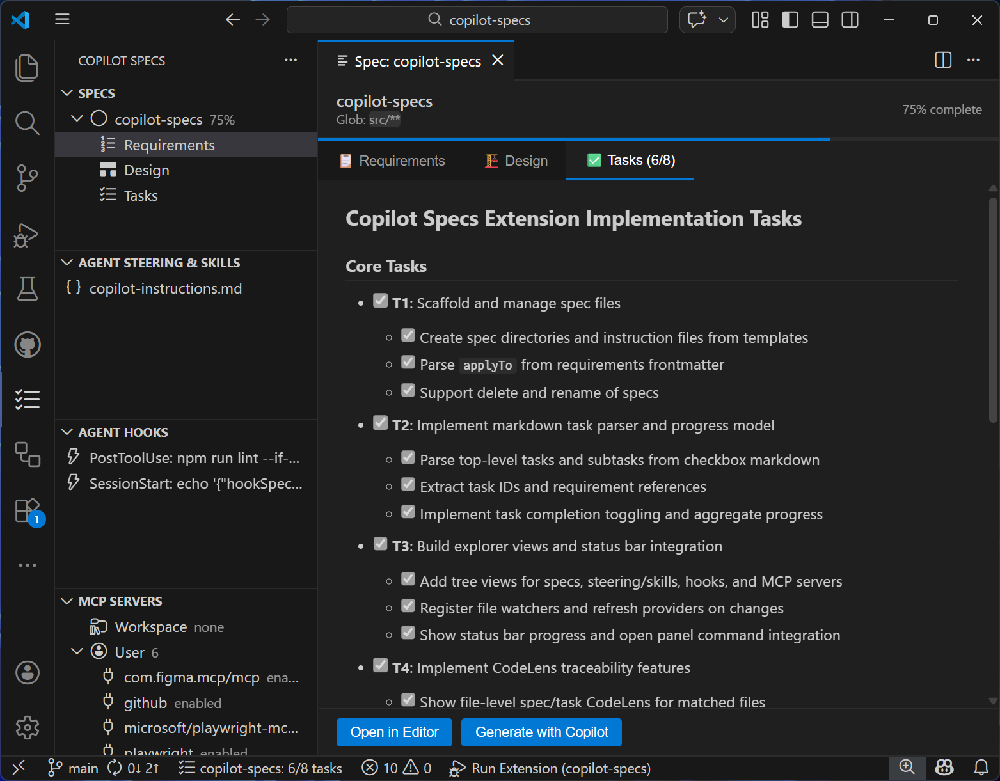
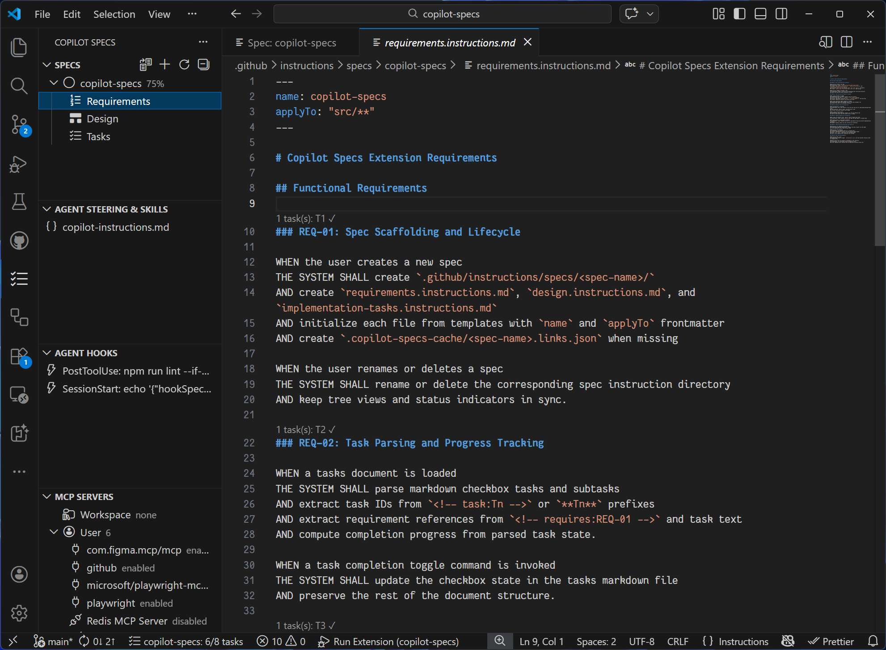
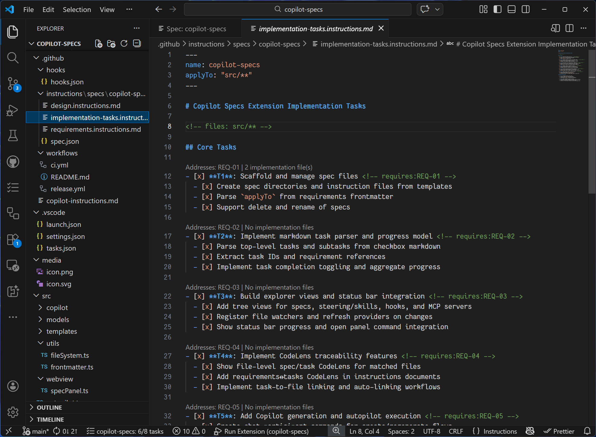
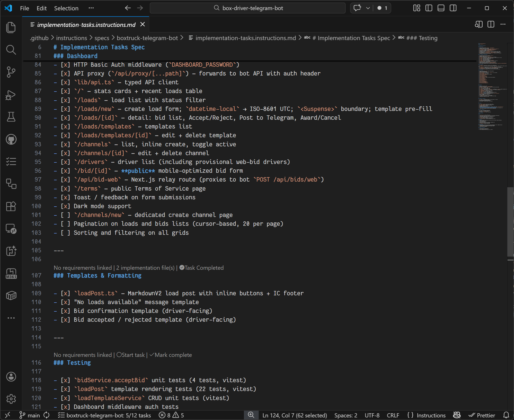

# Copilot Specs

[](https://github.com/moonolgerd/copilot-specs/actions/workflows/ci.yml)
[](https://github.com/moonolgerd/copilot-specs/actions/workflows/release.yml)
[](https://marketplace.visualstudio.com/items?itemName=moonolgerd.copilot-specs)
[](https://marketplace.visualstudio.com/items?itemName=moonolgerd.copilot-specs)
[](https://marketplace.visualstudio.com/items?itemName=moonolgerd.copilot-specs)

Spec-driven development for VS Code + GitHub Copilot.

`copilot-specs` bridges the gap between planning and implementation — write structured **requirements**, **design**, and **task** documents, then have GitHub Copilot generate and execute them against your codebase. Every task links back to real source files via CodeLens so nothing gets lost.

## Install

**[Install from the VS Code Marketplace →](https://marketplace.visualstudio.com/items?itemName=moonolgerd.copilot-specs)**

Or search for `copilot-specs` in the VS Code Extensions panel (`Ctrl+Shift+X`).









## Features

- **Spec lifecycle**
  - Create, rename, and delete specs under `.github/instructions/specs/<spec-name>/`
  - Scaffold files from templates:
    - `requirements.instructions.md`
    - `design.instructions.md`
    - `implementation-tasks.instructions.md`

- **Task tracking + progress**
  - Parse markdown checkbox tasks and subtasks
  - Track completion progress per spec
  - Show spec progress in the status bar and panel

- **Traceability with CodeLens**
  - Link requirements ↔ tasks
  - Link tasks ↔ implementation files
  - Auto-link task references to code

- **Copilot integration**
  - Generate requirements, design, and tasks with chat participant commands
  - Start Task opens a rich context prompt in **agent mode** — the agent can read files, make edits, and run tests

- **Project guidance + tooling**
  - Instructions, rules, skills, and prompts explorer
  - Agent hooks explorer (`.github/hooks/*.json`)
  - MCP servers explorer and toggle support

## Requirements

- VS Code **1.93+**
- GitHub Copilot Chat (for AI generation and autopilot features)

## Quick Start

1. Install the extension from the [Marketplace](https://marketplace.visualstudio.com/items?itemName=moonolgerd.copilot-specs).
2. Open a workspace and run `Copilot Specs: New Spec` from the Command Palette (`Ctrl+Shift+P`).
3. Enter a name — three scaffold files are created under `.github/instructions/specs/<name>/`:
   - `requirements.instructions.md` — define what to build
   - `design.instructions.md` — describe the architecture
   - `implementation-tasks.instructions.md` — break work into checkable tasks
4. Use the **@spec** chat participant in Copilot Chat to generate content:
   ```
   @spec create a user authentication feature
   ```
5. Click **Start Task** on any task — a rich context prompt opens in agent mode where Copilot can read your code, make edits, and verify the result.

## Development

**Prerequisites:** Node.js 22+

Install dependencies:

```bash
npm ci
```

Build TypeScript:

```bash
npm run compile
```

Bundle extension:

```bash
npm run bundle
```

Watch mode:

```bash
npm run dev
```

Lint:

```bash
npm run lint
```

## Run the extension locally

1. Open this folder in VS Code.
2. Run `npm ci`.
3. Press `F5` to launch the Extension Development Host.
4. In the new window, run commands from the Command Palette, such as:
   - `Copilot Specs: New Spec`
   - `Copilot Specs: Open Spec Panel`
   - `Copilot Specs: Generate with Copilot`

## CI/CD

Workflows are in `.github/workflows/`:

- `ci.yml`
  - Runs on PRs and pushes to `main`
  - Executes `npm ci`, `npm run compile`, and `npm run bundle`

- `release.yml`
  - Runs on tag push `v*` or manual dispatch
  - Packages a `.vsix` artifact
  - Publishes to VS Marketplace when `VSCE_PAT` is configured

Required secret for publishing:

- `VSCE_PAT`

For workflow details, see `.github/workflows/README.md`.

## Publishing

Tag-based release example:

```bash
git tag v0.1.1
git push origin v0.1.1
```

Manual release is also available through the GitHub Actions UI.

## Repository layout

- `src/` — extension source
- `src/templates/` — default spec templates
- `.github/instructions/specs/` — generated/managed spec docs in a workspace
- `.github/prompts/` — reusable prompt files (`.prompt.md`)
- `.github/hooks/` — hook JSON definitions

## Hook JSON format

Hook files live in `.github/hooks/*.json` in your workspace. Each file contains a top-level `hooks` object whose keys are event names and whose values are arrays of command entries.

**Supported event names:** `SessionStart`, `UserPromptSubmit`, `PreToolUse`, `PostToolUse`, `PreCompact`, `SubagentStart`, `SubagentStop`, `Stop`.

```json
{
  "hooks": {
    "SessionStart": [
      {
        "type": "command",
        "command": "npm run lint",
        "cwd": "${workspaceFolder}",
        "timeout": 30000
      }
    ],
    "PostToolUse": [
      {
        "type": "command",
        "command": "npm test",
        "windows": "npm.cmd test",
        "env": { "CI": "true" }
      }
    ]
  }
}
```

| Field     | Type        | Required | Description                                       |
| --------- | ----------- | -------- | ------------------------------------------------- |
| `type`    | `"command"` | yes      | Must be `"command"`                               |
| `command` | string      | yes      | Shell command to run (default / Linux / macOS)    |
| `windows` | string      | no       | Override command for Windows                      |
| `linux`   | string      | no       | Override command for Linux                        |
| `osx`     | string      | no       | Override command for macOS                        |
| `cwd`     | string      | no       | Working directory (supports `${workspaceFolder}`) |
| `env`     | object      | no       | Additional environment variables                  |
| `timeout` | number      | no       | Timeout in milliseconds                           |

## MCP server config format

MCP server configurations are discovered from the following JSONC files (in priority order):

- `.vscode/mcp.json` — workspace-level
- `.mcp.json` — project-level
- `mcp.json` — root-level

Each file follows the VS Code MCP server schema:

```jsonc
{
  "servers": {
    "my-server": {
      "type": "stdio",
      "command": "npx",
      "args": ["-y", "my-mcp-package"],
      "env": { "API_KEY": "${env:MY_API_KEY}" },
    },
    "remote-server": {
      "type": "sse",
      "url": "https://example.com/mcp/sse",
    },
  },
}
```

The Copilot Specs MCP explorer lists all discovered servers and lets you toggle them on/off via the tree view. Toggling sets or removes the server entry from the applicable config file.

## License

MIT — see [LICENSE](LICENSE).

## Changelog

See [CHANGELOG.md](CHANGELOG.md) for release history.
